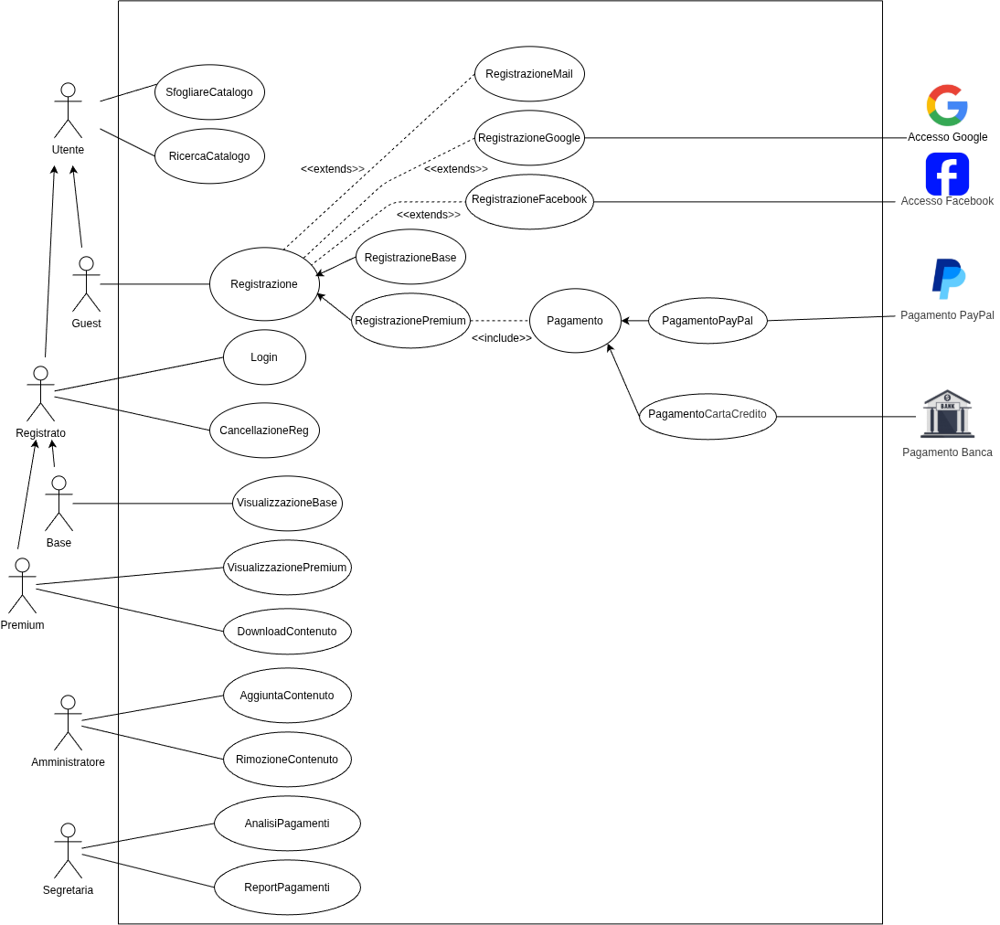
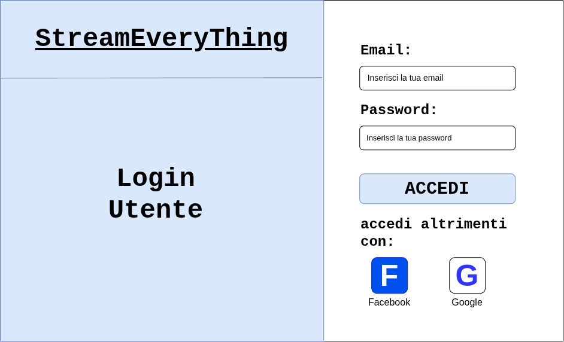

# Caso d'Uso: Sfogliare Catalogo

## Breve Descrizione: 
Permette a qualsiasi utente (registrato o non registrato) di esplorare i film e le serie TV presenti nel catalogo della piattaforma e di visualizzarne i dettagli.

## Attori primari: 
- Utente

## Attori secondari: 
Nessuno.

## Precondizioni: 
Nessuna.

## Sequenza degli eventi principale:
1. L'utente accede alla sezione cliccando su "Catalogo".
2. Il sistema recupera e mostra l'elenco dei contenuti presenti sulla piattaforma (titolo e copertina per ciascun titolo).
3. L'utente seleziona un contenuto cliccando sulla relativa copertina.
4. Il sistema mostra la scheda con tutte le informazioni dettagliate del contenuto (titolo, descrizione, tipologia e disponibilità in base all'abbonamento).
5. Se l'utente dispone dei permessi necessari per il contenuto selezionato, il sistema rende disponibile l'opzione per avviare la visualizzazione (collegata allo use case "Visualizzazione film/serie TV base" o "Visualizzazione film/serie TV premium").

## Postcondizioni: 
Il catalogo o le informazioni di dettaglio del contenuto selezionato sono visualizzati a schermo.

## Sequenza degli eventi alternativa: 

### A1. Catalogo vuoto
1. Il sistema verifica che non sono presenti contenuti nel catalogo.
2. Il sistema mostra un messaggio a schermo informando l'utente che il catalogo è momentaneamente vuoto.

### A2. Errore nel caricamento
1. Il sistema non riesce a recuperare i dati dei contenuti dal server.
2. Il sistema mostra un messaggio di errore e consente all'utente di ritentare il caricamento.

### A3. Contenuto non fruibile con il profilo corrente
1. Al passo 4, l'utente seleziona un contenuto che richiede un abbonamento di livello superiore (es. contenuto Premium selezionato da utente Base) oppure l'utente non è autenticato.
2. Il sistema mostra i dettagli del contenuto informando l'utente che è necessario effettuare l'upgrade dell'abbonamento o eseguire il login per avviare la riproduzione.

---

# Caso d'Uso: Login

## Breve Descrizione: 
Permette a un utente registrato di accedere al proprio account personale sulla piattaforma tramite email e password oppure tramite account esterno (Google o Facebook).

## Attori primari: 
- Utente Registrato

## Attori secondari: 
- Google
- Facebook

## Precondizioni: 
L'utente deve essersi precedentemente registrato alla piattaforma.

## Sequenza degli eventi principale:
1. L'utente accede alla sezione di autenticazione cliccando sul pulsante "Login".
2. Il sistema mostra la schermata di login contenente il modulo con i campi per email e password e i pulsanti per l'accesso rapido tramite account esterni.
3. L'utente inserisce la propria email e la propria password nei rispettivi campi e clicca su "ACCEDI".
4. Il sistema verifica la correttezza delle credenziali fornite.
5. Il sistema autentica l'utente, inizializza la sessione utente con il profilo corrispondente (Base o Premium) e mostra la schermata principale.

## Postcondizioni: 
L'utente ha effettuato con successo il login e la sua sessione di lavoro risulta attiva.

## Sequenza degli eventi alternativa: 

### A1. Accesso tramite Google
1. Al passo 3, l'utente seleziona l'accesso rapido cliccando sul pulsante Google.
2. Il sistema reindirizza l'utente al servizio di autenticazione esterno di Google.
3. Google convalida l'identità dell'utente e restituisce l'esito positivo al sistema.
4. Il sistema autentica l'utente e il flusso prosegue dal passo 5 del flusso principale.

### A2. Accesso tramite Facebook
1. Al passo 3, l'utente seleziona l'accesso rapido cliccando sul pulsante Facebook.
2. Il sistema reindirizza l'utente al servizio di autenticazione esterno di Facebook.
3. Facebook convalida l'identità dell'utente e restituisce l'esito positivo al sistema.
4. Il sistema autentica l'utente e il flusso prosegue dal passo 5 del flusso principale.

### A3. Credenziali non valide
1. Al passo 4, il sistema rileva che l'indirizzo email o la password inseriti non sono corretti.
2. Il sistema mostra un messaggio di errore a schermo e invita l'utente a reinserire le credenziali corrette senza abbandonare la pagina di login.
