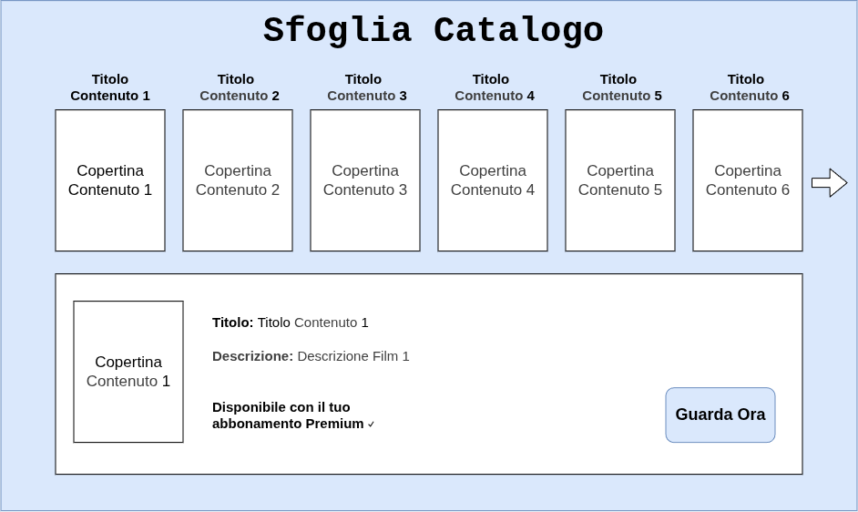

Listed directory progetto_fis1
Ran command: `pdftotext "Laboratorio 1 - Assignment.pdf" -`
Viewed uctextual.md:1-52
Viewed note.md:1-30
Viewed tmp.md:1-48
Viewed diagramma.drawio:1-100
Viewed diagramma.drawio:101-274
Viewed mockup1.drawio:1-76
Viewed mockup2.drawio:1-58
Ran command: `which drawio || which draw.io || which inkscape || which node`

Ho controllato tutti i file del tuo progetto confrontandoli con le richieste dell'assegnamento del **Laboratorio 1** ([`Laboratorio 1 - Assignment.pdf`](file:///home/tex/dev/Uni/anno3-semestre1/FIS/progetto_fis1/Laboratorio%201%20-%20Assignment.pdf)), con i mockup e con le convenzioni standard di **Fondamenti di Ingegneria del Software (FIS)**.

Hai fatto un ottimo lavoro iniziale sui mockup e sulla struttura, ma ci sono **alcuni errori formali e metodologici importanti** (soprattutto su flussi alternativi, notazione UML e requisiti di consegna) che i docenti di FIS penalizzano.

---

### 1. Requisiti di Consegna e Struttura File (Task A, B, C)

| Requisito Traccia | Stato Attuale | Cosa fare |
| :--- | :--- | :--- |
| **Cartella `Lab1`** | Tutti i file sono nella cartella radice | Crea una cartella `Lab1/` e sposta i file al suo interno. |
| **Nome file diagramma** | Si chiama [`diagramma.drawio`](file:///home/tex/dev/Uni/anno3-semestre1/FIS/progetto_fis1/diagramma.drawio) | Rinominalo in `ucdiagram.drawio`. |
| **Esportazione PNG** | Nessun file `.png` presente | Esporta da Draw.io: `ucdiagram.png`, `mockup1.png`, `mockup2.png`. |
| **Immagini in `uctextual.md`** | Nessuna immagine inserita | Inserisci `` all'inizio e i mockup nei rispettivi casi d'uso. |
| **Consegna finale** | Non ancora creata | Creare lo zip `Lab1_COGNOME1[_COGNOMEn].zip` contenente la cartella `Lab1/`. |

---

### 2. Revisione dei Due Screen Mockup

I mockup disegnati sono **molto chiari e pertinenti**:

1. **[`mockup1.drawio`](file:///home/tex/dev/Uni/anno3-semestre1/FIS/progetto_fis1/mockup1.drawio) (`Sfogliare Catalogo`)**:
   - **Punti di forza**: Ottimo layout. Mostra sia la panoramica con griglia dei titoli (passi 2–3) sia il dettaglio del film selezionato con copertina, descrizione, badge di disponibilità Premium e pulsante *"Guarda Ora"* (passi 4–6).
   - **Corrispondenza**: Perfetta aderenza al caso d'uso descritto.
2. **[`mockup2.drawio`](file:///home/tex/dev/Uni/anno3-semestre1/FIS/progetto_fis1/mockup2.drawio) (`Login`)**:
   - **Punti di forza**: Layout a due colonne moderno ed efficace. A sinistra il logo *StreamEveryThing*, a destra il form classico (Email, Password, bottone ACCEDI) e l'autenticazione tramite terze parti (*Facebook* e *Google*).
   - **Corrispondenza**: Copre in pieno la specifica della traccia.

---

### 3. Revisione del File [`uctextual.md`](file:///home/tex/dev/Uni/anno3-semestre1/FIS/progetto_fis1/uctextual.md)

Qui ci sono le criticità maggiori rispetto ai criteri di valutazione di FIS:

#### A. Caso d'Uso: Sfogliare Catalogo
* **Flussi Alternativi vuoti**: in [`uctextual.md`](file:///home/tex/dev/Uni/anno3-semestre1/FIS/progetto_fis1/uctextual.md) hai scritto solo `` `AssenzaContenuti`, `ErroreCaricamento` ``. Nei casi d'uso le sequenze alternative devono essere **passi numerati** (come avevi iniziato a fare in [`tmp.md`](file:///home/tex/dev/Uni/anno3-semestre1/FIS/progetto_fis1/tmp.md)).
* **Postcondizioni**: invece di *"Nessuna"*, è opportuno scrivere ad esempio: *"Il catalogo o le informazioni di dettaglio del contenuto selezionato sono mostrate a schermo"*.

#### B. Caso d'Uso: Login
* **Errore metodologico nel Flusso Principale (Happy Path)**:
  Hai scritto costrutti di controllo da codice sorgente nel testo:
  > *2. Se l'utente ha fatto la registrazione con mail...*  
  > *3. Altrimenti se l'utente si è registrato con google...*  
  > *5. Fintantoché le credenziali non sono corrette...*  
  
  In Ingegneria del Software, la **Sequenza Principale** descrive solo il **cammino ideale di successo nominale** (es. inserimento credenziali email/password e accesso confermato).  
  - Il login tramite **Google** o **Facebook** va nelle **Sequenze Alternative** (es. *A1: Accesso tramite Google*, *A2: Accesso tramite Facebook*).  
  - Il ciclo di errore credenziali errate va anch'esso nelle **Sequenze Alternative / Eccezioni** (es. *A3: Credenziali non valide*).
* **Attore primario**: Meglio indicare **Utente registrato** (la traccia specifica chiaramente *"solo utenti registrati"*).

---

### 4. Revisione del Diagramma dei Casi d'Uso ([`diagramma.drawio`](file:///home/tex/dev/Uni/anno3-semestre1/FIS/progetto_fis1/diagramma.drawio))

Rispondendo anche alle note e ai dubbi che avevi appuntato in [`note.md`](file:///home/tex/dev/Uni/anno3-semestre1/FIS/progetto_fis1/note.md):

1. **Notazione frecce di ereditarietà tra attori**:
   - Le generalizzazioni tra attori (`Base`/`Premium` $\to$ `Registrato` $\to$ `Utente`) in UML richiedono la **freccia con punta a triangolo vuoto/chiuso** (`style="endArrow=block;endFill=0;"`), non la freccia a linea aperta (`->`).
2. **Accessibilità di `VisualizzazioneBase`**:
   - Nel testo: *"Visualizzazione film/serie TV base (solo utenti registrati)"*.
   - Nel tuo diagramma l'hai collegata solo a `Base`. Ma un utente `Premium` può guardare *tutti* i titoli!  
   - Soluzione: collega `VisualizzazioneBase` direttamente all'attore `Registrato` (così sia Base che Premium la ereditano), oppure fai ereditare `Premium` da `Base`.
3. **Attori secondari Google e Facebook**:
   - In [`diagramma.drawio`](file:///home/tex/dev/Uni/anno3-semestre1/FIS/progetto_fis1/diagramma.drawio) sono caselle di testo con una lettera "G" e "F". Trattandosi di sistemi esterni, vanno modellati come veri e propri **Attori secondari** a destra del sistema (sagoma stickman o rettangolo con stereotipo `<<actor>>`).
4. **Stereotipo `<<extend>>` e direzione**:
   - Nel file c'è scritto `<<extends>>` (con la *s* finale). In UML si scrive al singolare `<<extend>>`.
   - La direzione della freccia tratteggiata di extend deve sempre puntare dal caso d'uso estendente verso quello base:  
     `CasoEstendente --<<extend>>--> CasoBase`.
5. **Dubbio su `ControllaAbbonamento` (da [`note.md`](file:///home/tex/dev/Uni/anno3-semestre1/FIS/progetto_fis1/note.md))**:
   - **Non** creare uno use case `ControllaAbbonamento`: è un anti-pattern procedurale. In UML i casi d'uso rappresentano obiettivi dell'utente (goal di business), non funzioni software o istruzioni `if`. La differenziazione degli attori (`Base`, `Premium`) risolve già elegantemente il problema dei permessi.

---

### Versione Corretta Consigliata per [`uctextual.md`](file:///home/tex/dev/Uni/anno3-semestre1/FIS/progetto_fis1/uctextual.md)

Ecco come dovrebbe presentarsi il file per ottenere il punteggio massimo:

```markdown


# Caso d'Uso: Sfogliare Catalogo

## Breve Descrizione: 
Permette a qualsiasi utente (registrato o non registrato) di esplorare i titoli dei film e delle serie TV presenti sulla piattaforma e consultarnee i dettagli.

## Attori primari: 
- Utente

## Attori secondari: 
Nessuno.

## Precondizioni: 
Nessuna.

## Sequenza degli eventi principale:
1. L'utente accede alla sezione "Catalogo".
2. Il sistema recupera e mostra l'elenco dei contenuti disponibili, visualizzando per ciascuno titolo e copertina.
3. L'utente seleziona un contenuto specifico.
4. Il sistema mostra la scheda dettagliata del titolo (titolo, descrizione, tipologia e disponibilità in base all'abbonamento).
5. Se l'utente dispone dei permessi necessari, il sistema rende disponibile l'opzione per avviare la visualizzazione.



## Postcondizioni: 
Il catalogo o la scheda informativa del titolo selezionato sono visualizzati a schermo.

## Sequenza degli eventi alternativa: 

### A1. Catalogo vuoto
1. Il sistema verifica che non sono presenti contenuti nel catalogo.
2. Il sistema mostra un messaggio informativo indicando che il catalogo è momentaneamente vuoto.

### A2. Errore di caricamento
1. Il sistema non riesce a recuperare i dati dal server.
2. Il sistema notifica l'errore all'utente consentendogli di ritentare il caricamento.

### A3. Titolo non fruibile con il profilo corrente
1. Al passo 4, l'utente seleziona un contenuto Premium ma dispone di un profilo Base (o non è autenticato).
2. Il sistema mostra i dettagli del contenuto informando l'utente della necessità di eseguire l'upgrade a Premium o il login per visualizzarlo.

---

# Caso d'Uso: Login

## Breve Descrizione: 
Permette a un utente registrato di autenticarsi sulla piattaforma per accedere alle funzionalità riservate.

## Attori primari: 
- Utente Registrato

## Attori secondari: 
- Google
- Facebook

## Precondizioni: 
L'utente deve possedere un account precedentemente registrato.

## Sequenza degli eventi principale:
1. L'utente accede alla schermata di Login.
2. Il sistema mostra il modulo di accesso con i campi email/password e le opzioni di accesso rapido.
3. L'utente inserisce la propria email e password e conferma l'invio premendo "ACCEDI".
4. Il sistema verifica la correttezza delle credenziali inserite.
5. Il sistema autentica l'utente, inizializza la sessione con il profilo corrispondente (Base o Premium) e reindirizza alla home page.


## Postcondizioni: 
L'utente risulta autenticato nel sistema con la relativa sessione attiva.

## Sequenza degli eventi alternativa: 

### A1. Accesso tramite Google
1. Al passo 3, l'utente seleziona l'accesso rapido tramite Google.
2. Il sistema reindirizza la richiesta al provider esterno Google.
3. Google convalida l'identità dell'utente e restituisce l'esito positivo al sistema.
4. Il flusso riprende dal passo 5 del flusso principale.

### A2. Accesso tramite Facebook
1. Al passo 3, l'utente seleziona l'accesso rapido tramite Facebook.
2. Il sistema reindirizza la richiesta al provider esterno Facebook.
3. Facebook convalida l'identità dell'utente e restituisce l'esito positivo al sistema.
4. Il flusso riprende dal passo 5 del flusso principale.

### A3. Credenziali non valide
1. Al passo 4, il sistema rileva che l'email o la password sono errate.
2. Il sistema mostra un messaggio di errore e invita l'utente a reinserire le credenziali corrette.
```

---

Vuoi che proceda ad aggiornare direttamente [`uctextual.md`](file:///home/tex/dev/Uni/anno3-semestre1/FIS/progetto_fis1/uctextual.md) e a riorganizzare la cartella `Lab1` con i nomi previsti dalla traccia?